<p align="center">
  <a href="https://github.com/AFZ216">
    
  </a>
</p>

## 🌟 About Me

```dart
class AliFayazi {
  final education   = "Computer Engineering @ Shahid Beheshti University (SBU), Tehran";
  final focus       = "Cross-platform mobile apps with Flutter & Dart";

  final workingOn   = ["Mobile apps", "University projects"];
  final learning    = ["Clean Architecture", "State Management", "Backend Development"];
  final collabOn    = ["Mobile app projects", "Student projects"];
  final alsoEnjoy   = "Making games with Unity & C#";

  final askMeAbout  = ["Flutter", "Python", "C#", "Git"];
  final reachMe     = "ali.fayazi216@gmail.com";
  final pronouns    = "He/Him";
}
```

---

## 💡 Languages and Tools

<p align="center">
  
</p>

---

## 🛠 Highlighted Projects

- 💳 **Fintech Super-App Client** — full front-end of a financial mobile app · `Flutter, Dart, REST APIs`
- 🎧 **Music Player App** — mobile audio player with a clean UI · `Flutter, Dart`
- 🎮 **Multiplayer Game** — online/offline modes with lobby & host/client sync · `Unity, C#`
- 🎵 **Audio Signal Processing** — echo & reverb effects built from scratch · `Python`
- 🖥 **TIS-100 Processor Node** — ISA design & implementation of a parallel processing node (T21) · `SystemVerilog`

---

## 📊 GitHub Stats

<p align="center">
  
  
</p>

<p align="center">
  
</p>

---

## 🐍 Contribution Snake

<p align="center">
  <picture>
    <source media="(prefers-color-scheme: dark)" srcset="https://raw.githubusercontent.com/AFZ216/AFZ216/output/github-contribution-grid-snake-dark.svg">
    
  </picture>
</p>

---

## 🌐 Connect with me

<p align="center">
  <a href="mailto:ali.fayazi216@gmail.com"></a>
  <a href="https://github.com/AFZ216"></a>
  <a href="https://t.me/Ali_216dddk"></a>
  <a href="https://www.instagram.com/_ali_fayazi_"></a>
</p>


